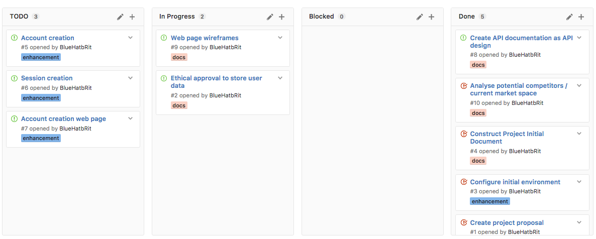

# Scaffold - 08-02-2017

* **Student:** Elliot Blackburn
* **Current iteration:** High level product design
* **Estimate of hours worked since last highlight:** 20 hours, this is 10 hours under the desired (see below).

I am currently looking at the design of the HTTP API and creating some wireframes for the web console. These will be rough starting points for the project, but will be updated as the project moves forward to act as final developer documentation.

Sadly the number of hours spent on the project over the last week has dropped significantly due to a personal emergency. I believe I am still on track to complete the project as proposed without any special action being taken as original time estimates included a buffer of time.

## Work completed

1. HTTP API Design is complete, this is documented and has been uploaded as a misc document to the SPMS. This design includes all the current expected HTTP end points that will be implemented for the final deliverable. They will provide a solid point of reference during API development.
2. A web styling (css) framework has been chosen which will be applied to the main web console. This will be used across the entire console to ensure a consistent and appealing style across the visual platform. Details of this are below, see Style Framework section below.
3. Initial code architecture has been setup and the services can run on a unix system with minimal configuration required.
4. Vagrant box and provisioning configured as a development environment that is platform agnostic.

## Work in progress

1. Creating wireframes to act as reference points for the web console layouts and styles.
2. Begun to read and review the current ethical approval for the module to ensure I need to apply for my own ethical approval.

## Further details

### Kanban board

Below is a screenshot of the Kanban board on Wednesday 15th Feburary which represents the current status of the project.

### Style framework

I've chosen to use the open source styling framework [Milligram](milligram.github.io). I have used this once before on a smaller university project and have decided to use it here as well. I believe it will bring the following to the project:

* Clear structure to visual page layouts that make the page easy to navigate.
* A consistent set of styles across the entire web console.
* A grid system using CSS Flexible Box, which helps to make web pages responsive to screen sizes.

## Questions for client (supervisor)

None at this time.