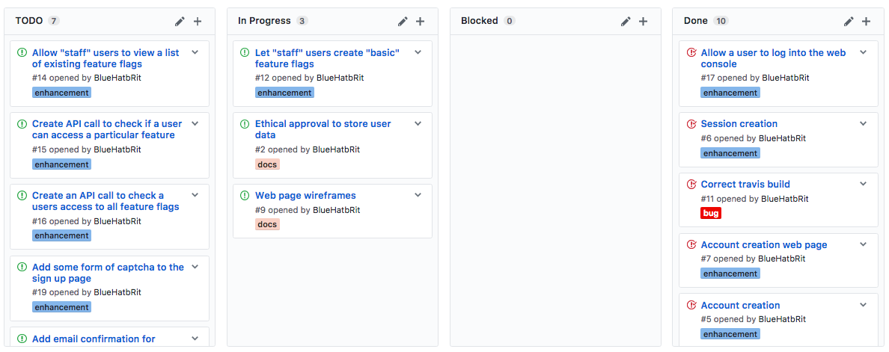

# Scaffold - 22-02-2017

* **Student:** Elliot Blackburn
* **Estimate of hours worked since last highlight report:** 15 hours

Sadly this week I have had tonsillitis and have been unable to work the usual amount, as a result progress has slowed this week. This is where my pesemistic time estimations are useful as I have now allowed myself enough time to account for this sort of incident. I believe I should be able to complete this block of work on time.

## Work completed

1. Automated CI connected to the codebase using GitHub and Travis CI. All tests are now run automatically when any code change is pushed.
2. Implemented web console log in / log out features.

## Work in progress

1. Implementing the ability to create "basic" feature flags.
2. Ethical approval form was put on hold this week due to illness so that is still in progress now.

## Further details

### Kanban board

Below is a screenshot of the kanban board on Wednesday 22nd Feburary which represents the current status of the project.

