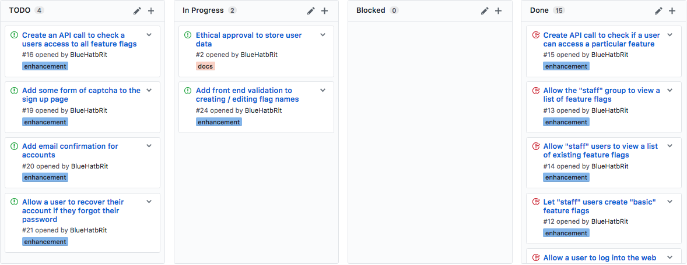

# Scaffold - 08-03-2017

* **Student:** Elliot Blackburn
* **Estimate of hours worked since last highlight report:** 18 hours

I've been able to up my hours this week after confirmation from my doctor to begin slowly increasing them. By Friday I hope to have hit 25 to 30 hours on this project since the last highlight meeting.

After an email conversation with my supervisor, we will be conducting highlight meetings via Skype due to my current illness.

## Work completed

1. Implemented the ability to create "basic" feature flags (simple on/off).
2. Created the API to query the users access to existing features.
3. User can now edit "basic" feature flags to toggle them on/off or change descriptions. As per the spec, the name is not changable.

## Work in progress

1. Adding validation to the create and edit "basic" feature flag screen.
2. Ethical approval form needs completion, awaiting response from Paula Simons with details of submission process.
3. Attempting to setup the project on Heroku for free hosting to demo the application and allow testers to easily host it with a single click.

## Further details

The application has a brittle version of the basic feature flag in place now which can be used via both the web interface and the API. These flags can be toggled at any time very easily through the web interface. Currently some validation on the front end added to ensure that flag names are hyphenated, and this is current in progress.

During the user testing, easy deployment is going to be absolutely key to help engage some people to trying out the application. I'm going to add a simple "Deploy to Heroku" button onto the repository which will provide a single button to deploy to a free heroku node. This will enable my testers to have their own deployment on demand and easily re-deploy should something go wrong. The use of Heroku will also enable me to demonstrate the application to my client (supervisor) much easier with a simple public web link.

### Kanban board

Below is a screenshot of the kanban board on Wednesday 8th March which represents the current status of the project.

