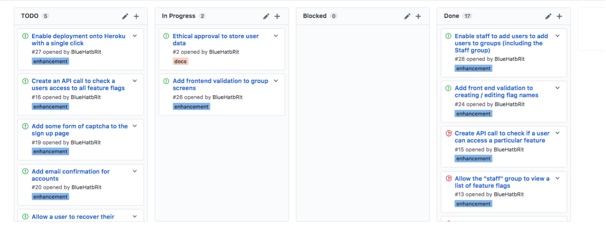

# Scaffold - 15-03-2017

* **Student:** Elliot Blackburn
* **Estimate of hours worked since last highlight report:** 30 hours

Glandular fever has been confirmed by my doctor which means the condition is well understood. I should be back to health in around a week or two weeks.

Meanwhile I've managed to maintain a fairly normal work schedule, and progress on flags and user groups has been good. I have successfully made the transition into development increment 2 with better progress than the PID expects.

## Work completed

1. Basic feature flags are completely implmeneted with a single request that can be made to check the access the user should have to the feature.
2. Staff users have been given the ability to add other users to the "Staff" group, in preperation for the "group based" feature flag.

## Work in progress

1. Validation is being added to the "Add user to group" screen, this should give better feedback when a user attempts to add an invalid user to a group.
2. Up the unit test coverage around flags and user groups to ensure correctness and security.
3. Finding a way to enable better deployment to server infrastructure such as heroku, potentially migrating config files over to environment variables.

## Further details

The application is beginning to take shape yet is difficult to navigate. The user experience is by far not great and some better navigation displays may be better in order to solve this.

The application is beginning to take shape in terms of functionality, the next move is to begin implmeneting group based feature flags and and percentage based feature flags.

As potential employeer has expressed interest in seeing the application in a working state when it is ready for user testing. This signals the beginning of signing on potential interest for testing and feedback. The ethical approval form needs completing an handing in. According to the head of ethical approval for computing and mathematics, this aproval timeframe should be around 10-12 days so as long as it is submitted in the next 7 days it should be ready in time.

### Kanban board

Below is a screenshot of the kanban board on Wednesday 15hth March which represents the current status of the project.

