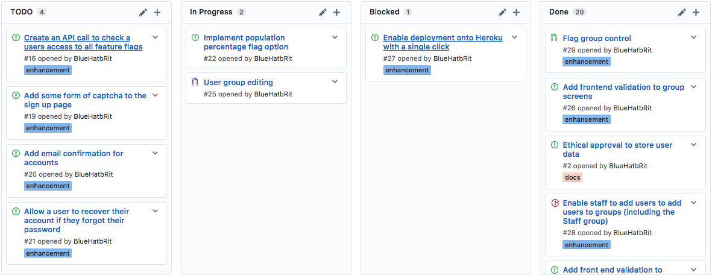

# Scaffold - 30-03-2017

* **Student:** Elliot Blackburn
* **Estimate of hours worked since last highlight report:** 35 hours

After a return to Plymouth, development is moving forward at a fast pace now and I'm catching up on the few things that have fallen behind.

## Work completed

1. Groups can be given access to specific feature flag.
2. Ethical approval application has now been submitted.

## Work in progress

1. Group access to feature flags is currently being implemented into the access query API call which should be delivered by the end of today (30/3/2017).
2. Population percentage based feature flag access.
3. Approach parties who have expressed interest in taking part in user testing and feedback.

## Further details

My original PID states that the current iteration should be finished by tomorrow. However there is still one outstanding feature remaining which is the percentage based feature flag option. As a result this means that I will most likely have to cut the final optional development iteration or at least reduce the amount of feedback I am able to act upon.

### Kanban board

Below is a screenshot of the kanban board on Wednesday 30th March which represents the current status of the project.

