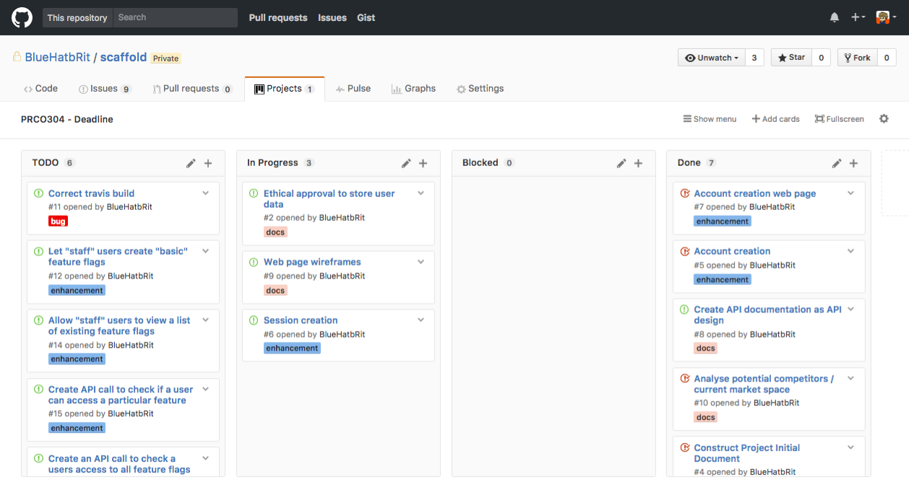
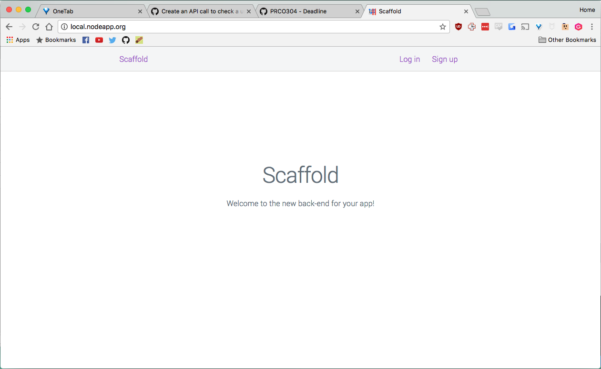
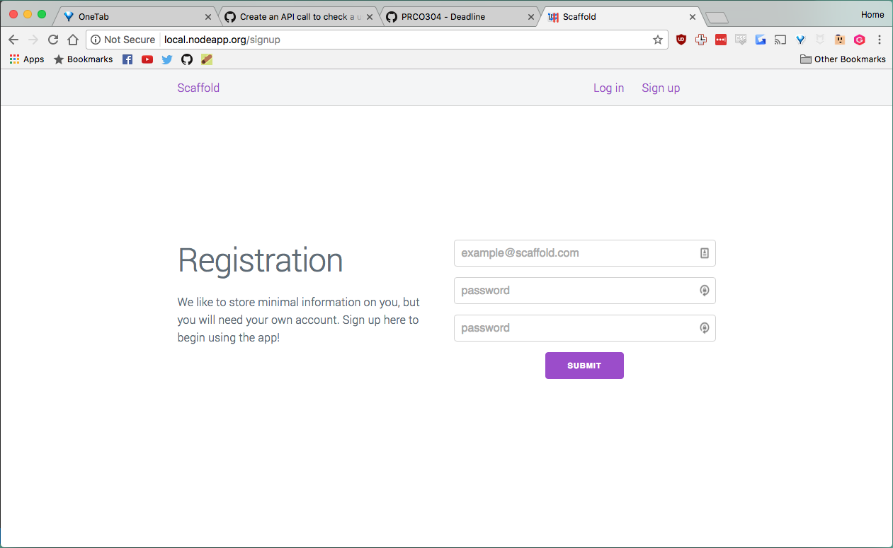

# Scaffold - 22-02-2017

* **Student:** Elliot Blackburn
* **Estimate of hours worked since last highlight report:** 30 hours

The code base has taken a lot of shape and the beginnings of the system are moving into place.

Most of the wireframes are complete and I've gone ahead and implemented the account registration screen and begun work on the login system. The API for both of these is also defined and working.

## Work completed

1. Wireframes for sign up, login, feature flag list, and feature flag creation are all complete.
2. API calls for account creation, and session creation have been made and work over HTTPS.
3. JWT authentication is implemented with Authorization Bearer header.
4. Automated tests have been created for all of these calls.

## Work in progress

1. Hooking up a CI system, Travis is giving some odd errors which seem to be due to issues with the Node.js box. Might switch to Wercker as the config files are almost identical.
2. Ethical approval form is nearly complete, this has been delayed by focusing on the wireframes but it's not top priority to ensure it's done in good time.
3. Login using the web interface (storing the JWT token) is nearly complete which will enable users to edit feature flags in the futures.

## Questions for client (supervisor)

None at this time.

## Further details

### Kanban board

Below is a screenshot of the kanban board on Wednesday 22nd Feburary which represents the current status of the project.

### Wireframes

The wireframes have helped to define the web page layout, there are still a few more to go but these along with the API documents now form the basis of an achievable specification. The wireframes are avalible via SPMS where they have been uploaded as miscellaneous deliverables.

### Account registration

Users can now register accounts through the web interface or through the HTTP API. I've begun a brief investigation into CSRF mitigation, as using a CSRF token requires cookies or sessions, I'm waiting until I've implemented the login feature. 

### Screenshots

On the following page are a few screenshots of the applications web-console. I've successfully implemented Milligram CSS and the styling matches my wireframes quite closely now.

Splash screen (index)

Sign up screen
