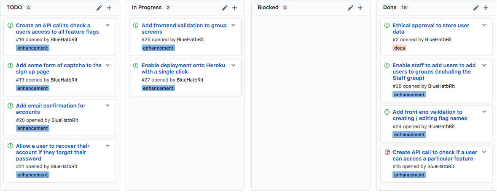

# Scaffold - 22-03-2017

* **Student:** Elliot Blackburn
* **Estimate of hours worked since last highlight report:** 30 hours

This weeks focus has been on ethical approval and ensuring better test coverage of the codebase.

## Work completed

1. Complete unit test coverage of flags, users, and sessions.
2. Complete the ethical approval application form (requires checking by supervisor)

## Work in progress

1. Validation is being added to the "Add user to group" screen, this should give better feedback when a user attempts to add an invalid user to a group.
2. Create "group based flags" which can allow a specific group access to an otherwise restricted feature.

## Further details

Now the some of the foundations are in place for the application, I need to hand in the ethical approval application in preperation for gathering feedback on the application. As a result I will need my supervisor (Thomas) to check the form and give his signature to it.

### Kanban board

Below is a screenshot of the kanban board on Wednesday 22nd March which represents the current status of the project.

